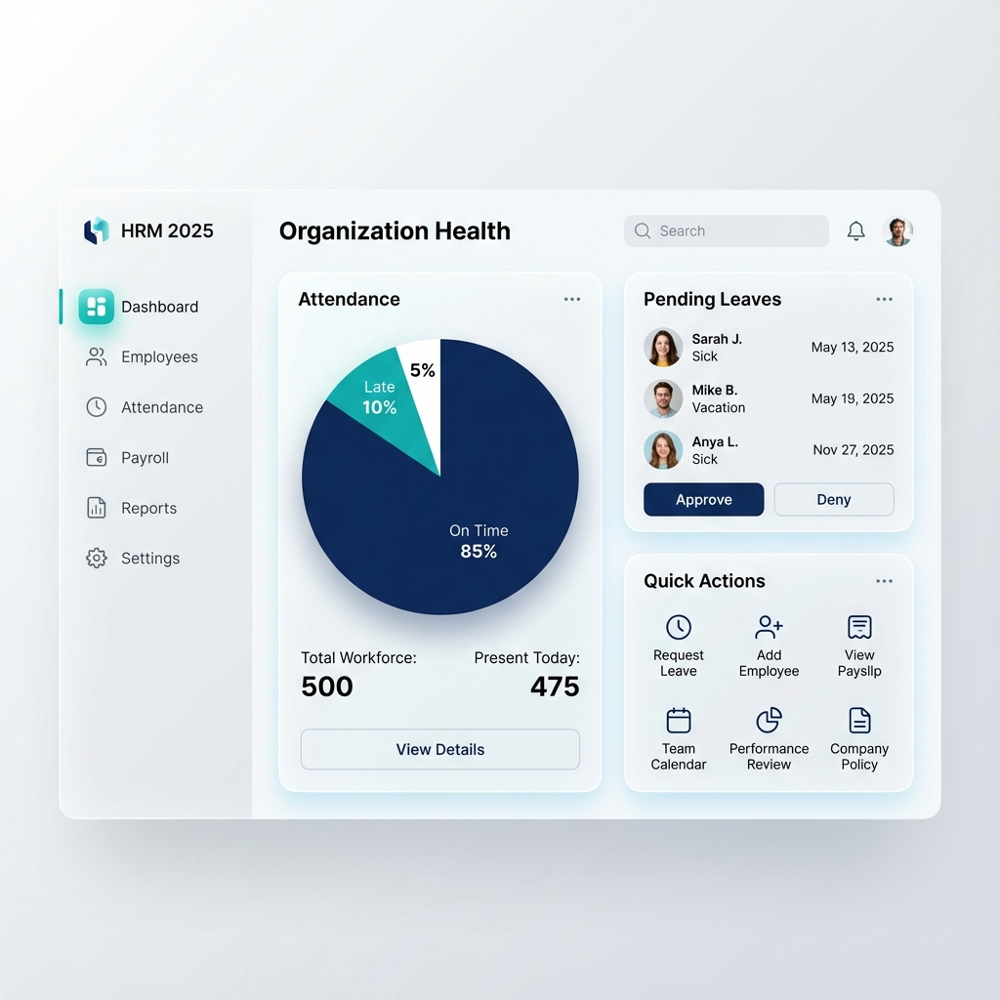
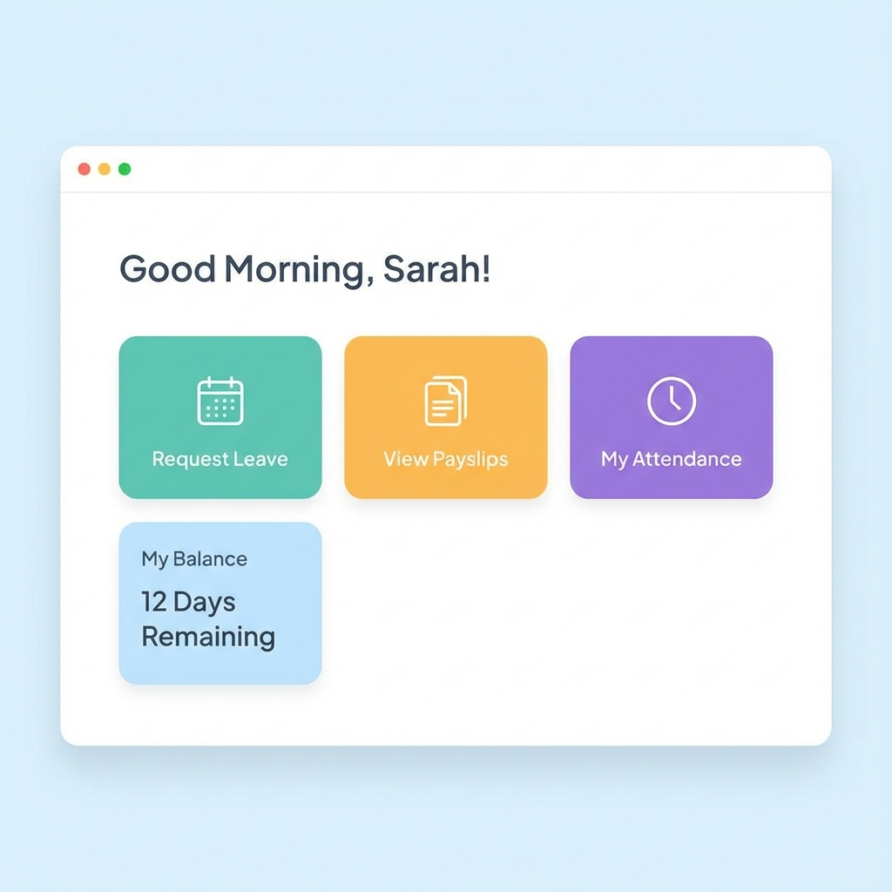

# Market Research & UX Design Strategy
**Project:** ASF ERP - HRM Module
**Date:** December 2025
**Version:** 2.0 (Deep Dive & Visual Concepts)

## 1. Executive Summary & Design Vision
To achieve a "Premium" and "Wow" factor while maintaining utility, our design strategy is a hybrid:
*   **For Admins:** A "Command Center" dashboard (inspired by Rippling) using **Glassmorphism** cards to organize dense data without clutter.
*   **For Employees:** A "Consumer-Grade" experience (inspired by BambooHR) with large, friendly greeting cards and ZERO complex tables.

---

## 2. Visual Concepts (Moodboard)

### 2.1 The "Glassmorphic" Admin Dashboard
*Target Audience: HR Admins & Super Admins*
**Concept:** Frosted glass cards on a light background. Soft shadows. Clean typography.

*   **Key Elements to Adopt:**
    *   **"Quick Action" Grid:** Don't bury "Add Employee" in a menu. Put it on the dashboard.
    *   **Visual Stats:** Use a Pie Chart for Attendance (Present vs Absent) instead of a text list.
    *   **Pending Queue:** A dedicated card for "Approvals" right on home.

### 2.2 The "Friendly" Employee Portal
*Target Audience: General Staff*
**Concept:** Minimalist. Welcoming. Big buttons.

*   **Key Elements to Adopt:**
    *   **Personalized Greeting:** "Good Morning, [Name]" header.
    *   **Big Targets:** Large, color-coded buttons for common tasks (Leave, Slip, Profile).
    *   **Balance Widget:** Show "Leave Remaining" clearly and immediately.

---

## 3. Competitor Feature Deep-Dive

### 3.1 BambooHR (Best for: Employee Experience)
*   **Leave Application Flow:**
    *   **UI:** Users click a date on a calendar grid → Modal opens → Select Type → Balance auto-shows below.
    *   **Takeaway:** We should **auto-calculate the return date** when a user selects "3 days".
*   **"Who's Out" Calendar:**
    *   **Feature:** A shared calendar widget on the dashboard showing who is on leave today.
    *   **Takeaway:** Add a "Team Availability" widget to the Manager's dashboard.

### 3.2 Rippling (Best for: Admin Productivity)
*   **The "To-Do" List:**
    *   **UI:** A "Inbox" style list at the top of the dashboard for things like "Sign Contract", "Approve Expense".
    *   **Takeaway:** We should have a central **"Action Center"** collection in our database to aggregate alerts from Payroll, Leave, and Onboarding.
*   **Payroll Preview:**
    *   **Feature:** Shows a "Diff" (Difference) between this month's payroll and last month's (e.g., "+$5,000" due to new hires).
    *   **Takeaway:** Add a **"Variance Report"** feature to our Payroll FRS.

### 3.3 Odoo (Best for: Profile Management)
*   **Smart Buttons:**
    *   **UI:** The Employee Profile header has clickable stats like "12 Contracts", "5 Equipment", "20 Time Off".
    *   **Takeaway:** Use **Smart Stats** at the top of the Employee Detail View (FRS003) instead of burying that info in tabs.

---

## 4. UI/UX Trends Checklist (2025)

| Element | Trend | Implementation Rule |
| :--- | :--- | :--- |
| **Material** | Glassmorphism | Use `backdrop-filter: blur(10px)` for high-priority cards. |
| **Typography** | Sans-Serif | Use **Inter** or **Outfit** (Google Fonts). font-weight: 500 for headers. |
| **Colors** | Semantic | **Green** for Success, **Red** for Action needed. Background: **#F3F4F6** (Cool Gray). |
| **Navigation** | Left Sidebar | Collapsible. Width: 240px (Expanded) / 64px (Collapsed). |
| **Modals** | Slide-overs | Use **Side Drawers** for "Quick Edit" forms instead of center modals to keep context. |
