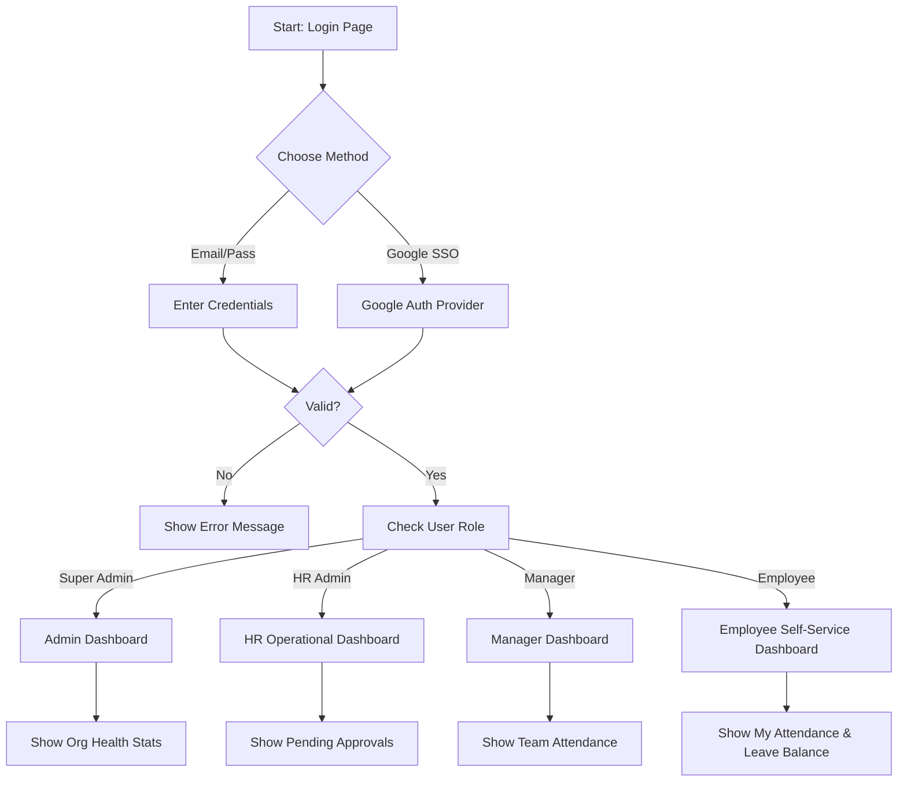
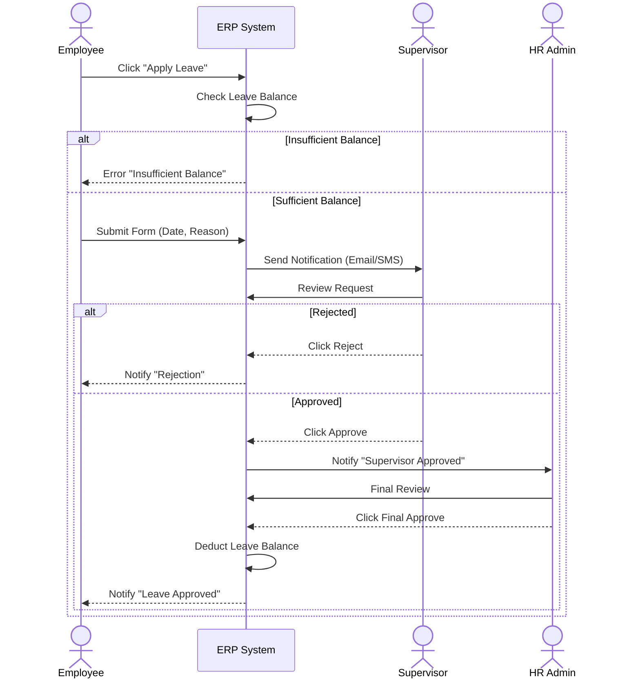
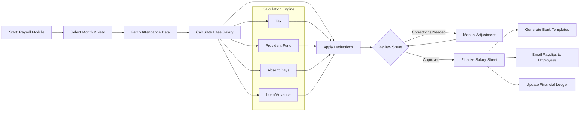
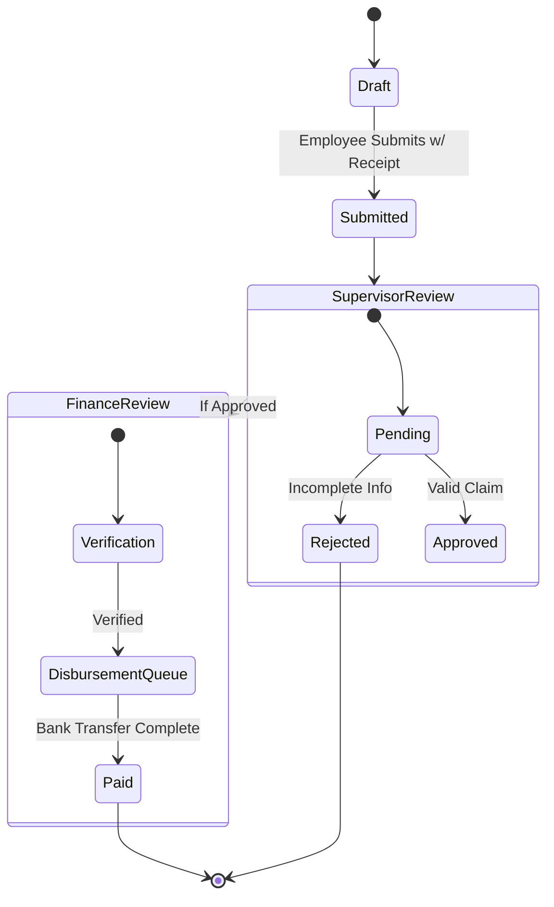
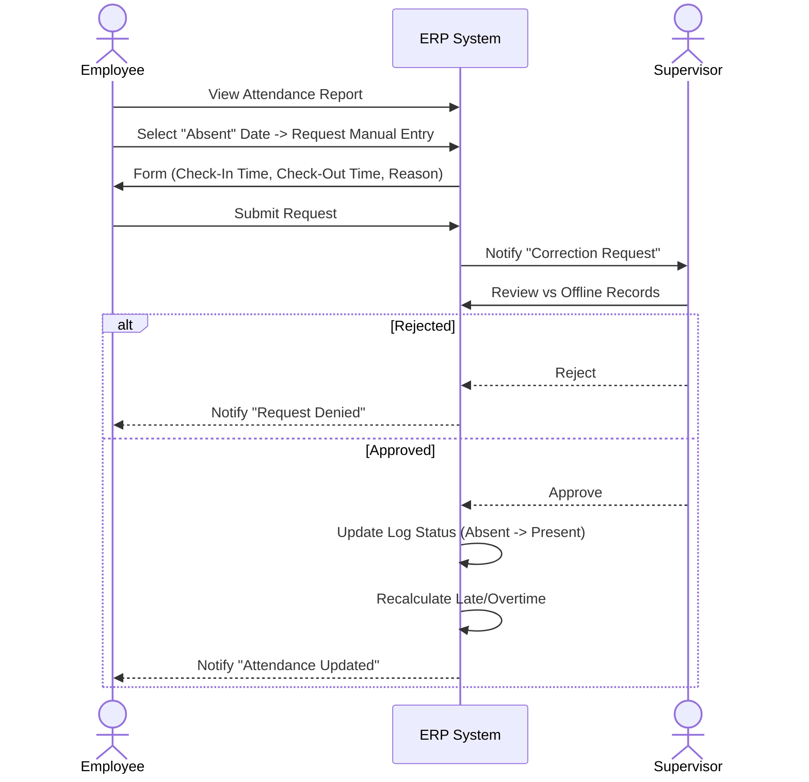

# User Flows & Process Diagrams
**Project:** ASF ERP - HRM Module
**Version:** 1.0

## 1. Authentication Flow
*How users access the system and get routed based on their role.*



## 2. Leave Application Workflow
*The process of applying for leave and the approval chain.*



## 3. Payroll Processing Flow
*Monthly salary generation cycle by Accounts/HR.*



## 4. Expense Claim Workflow
*How an employee claims reimbursement.*



## 5. Employee Onboarding Flow (New)
*The critical path of adding a new hire to the system.*

```mermaid
graph TD
    A[Start: Add Employee] --> B{Entry Method}
    B -->|Manual Form| C[Fill Basic Info]
    B -->|Bulk Import| D[Upload CSV]
    
    C --> E[System Generates Employee ID (Auto)]
    E --> F[Select Branch/Dept/Designation]
    F --> G[Set Salary & Bank Details]
    G --> H[Upload Documents (CV/NID)]
    
    H --> I{Create User Account?}
    I -->|Yes| J[Auto-Generate Email & Password]
    I -->|No| K[Profile Active (No Login)]
    
    J --> L[Send Welcome Email with Creds]
    L --> M[Onboarding Complete]
    K --> M
```

## 6. Attendance Correction Request (New)
*Handling "Forgot to punch" scenarios.*



## 7. Other Standard Flows
*Simpler CRUD operations that follow standard patterns:*
*   **Notice Creation:** Draft -> Select Audience -> Publish.
*   **Policy Management:** Draft -> Senior Mgmt Approval -> Publish to Dashboard.
*   **User Role Management:** Add User -> Assign Role -> Save.
