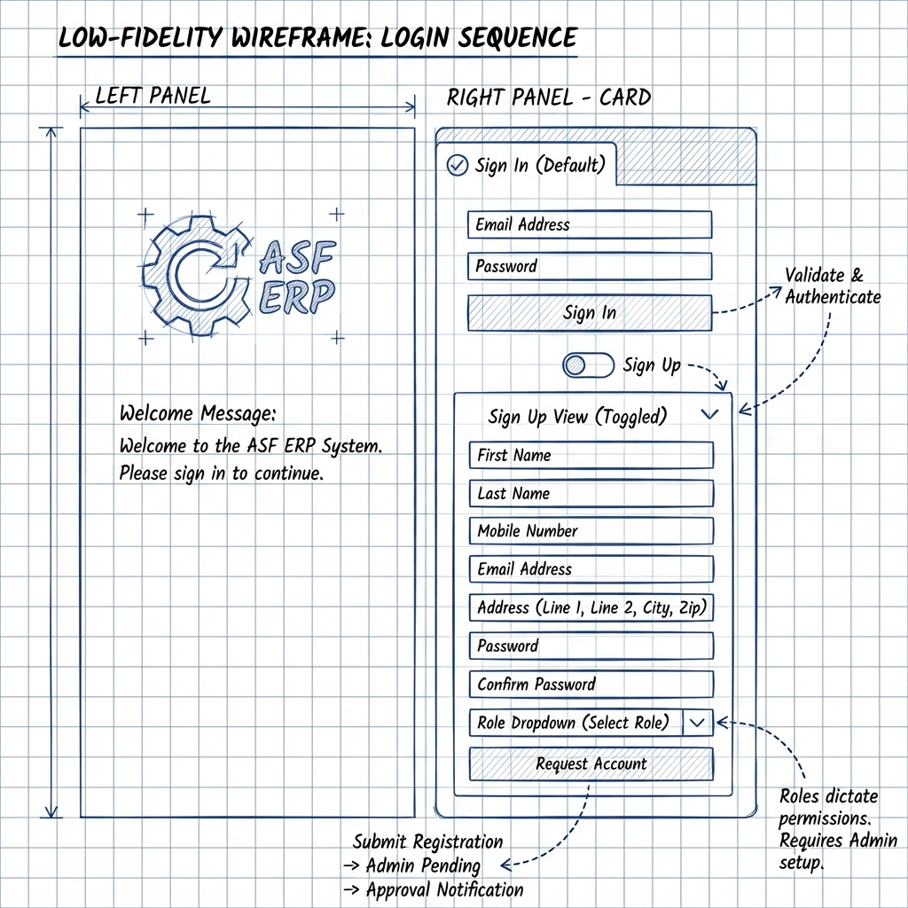

# Wireframe W01: User Signup & Login
**Requirement ID:** FRS001
**Role:** Unauthenticated User

## 1. Visual Layout
**Structure:** Split-Screen Layout.
*   **Left (35%):** Brand Identity (Logo, Welcome Message).
*   **Right (65%):** Authentication Card (Center Aligned).

## 2. Detailed Technical Specification
This wireframe strictly implements the data fields defined in **FRS001**.

### 2.1 State: Sign In (Default)
**Goal:** Authenticate existing users.

| Field Label | Input Type | Validation Rule |
| :--- | :--- | :--- |
| **Email Address** | Text (Email) | Valid email format. |
| **Password** | Password | Min 8 chars. |
| **Remember Me** | Checkbox | Optional. |

**Actions:**
*   [Primary] **Sign In**: Validates and redirects to Dashboard (FRS002).
*   [Secondary] **Continue with Google**: Triggers SSO flow.
*   [Link] **Forgot Password?**: Initiates recovery.
*   [Toggle] **Don't have an account? Sign Up**: Switches to State 2.2.

### 2.2 State: Sign Up (Registration)
**Goal:** onboard new users for Admin Approval.

| Ref | Field Label | Input Type | Mandatory? | Notes |
| :--- | :--- | :--- | :--- | :--- |
| **1** | **First Name** | Text | Yes | |
| **2** | **Last Name** | Text | Yes | |
| **3** | **Mobile Number** | Tel | Yes | Triggers OTP verification. |
| **4** | **Email / Username** | Text | Yes | Unique ID check + Email verification. |
| **5** | **Address** | Text Area | Yes | As per FRS001.5. |
| **6** | **Password** | Password | Yes | Min 8 chars. |
| **7** | **Confirm Password** | Password | Yes | Must match Field 6. |
| **8** | **Role Request** | Dropdown | Yes | e.g. "HR Manager", "Staff". |

**Actions:**
*   [Primary] **Create Account**:
    1.  Validates all fields.
    2.  Triggers **OTP Verification Flow** (State 2.3).

### 2.3 State: OTP Verification
**Goal:** Verify mobile number authenticity.

**Layout:**
*   **Header:** "Verify Your Mobile Number"
*   **Subtext:** "We've sent a 6-digit code to +880XXXXXXX123"
*   **Input:** 6-digit OTP input boxes
*   **Timer:** "Resend code in 00:59"

**Actions:**
*   [Primary] **Verify**: Validates OTP → Triggers Email Verification (State 2.4)
*   [Link] **Resend Code**: Sends new OTP
*   [Link] **Change Number**: Returns to signup form

### 2.4 State: Email Verification
**Goal:** Verify email address.

**Layout:**
*   **Header:** "Check Your Email"
*   **Subtext:** "We've sent a verification link to user@example.com"
*   **Icon:** Email illustration
*   **Instructions:** "Click the link in your email to verify your account"

**Actions:**
*   [Secondary] **Resend Email**: Sends new verification email
*   [Link] **Change Email**: Returns to signup form

### 2.5 State: Registration Complete
**Goal:** Confirm successful registration.

**Layout:**
*   **Success Icon:** Checkmark
*   **Header:** "Registration Submitted Successfully!"
*   **Message:** "Your account is pending admin approval. You'll receive a welcome email with login barcode once approved."
*   **Status:** `Pending Approval`

**Actions:**
*   [Primary] **Back to Login**: Returns to sign-in state

### 2.6 State: Basic Setup Page (Post-Login)
**Goal:** Initial user configuration after first login.

**Layout:** Welcome wizard
*   **Header:** "Welcome to ASF ERP!"
*   **Step 1:** Profile completion (Upload photo, verify contact details)
*   **Step 2:** Department/Branch confirmation
*   **Step 3:** System preferences (Language, Timezone, Notifications)

**Actions:**
*   [Primary] **Complete Setup**: Redirects to user-specific dashboard

## 3. Complete Authentication Flow
1. **Sign Up** → **OTP Verification** → **Email Verification** → **Registration Complete**
2. **Admin Approval** → **Welcome Email with Barcode** sent
3. **First Login** → **Basic Setup Page** → **User-Specific Dashboard**

## 4. SRS Alignment Check
*   ✅ **Methods:** Google SSO & Email included.
*   ✅ **Fields:** All 8 required fields from FRS001 included.
*   ✅ **OTP Verification:** Mobile phone OTP verification implemented.
*   ✅ **Email Verification:** Email verification flow included.
*   ✅ **Welcome Email:** Barcode email mentioned in registration complete.
*   ✅ **Basic Setup:** Post-login setup page included.
*   ✅ **Flow:** Complete signup → verification → approval → setup → dashboard flow.
