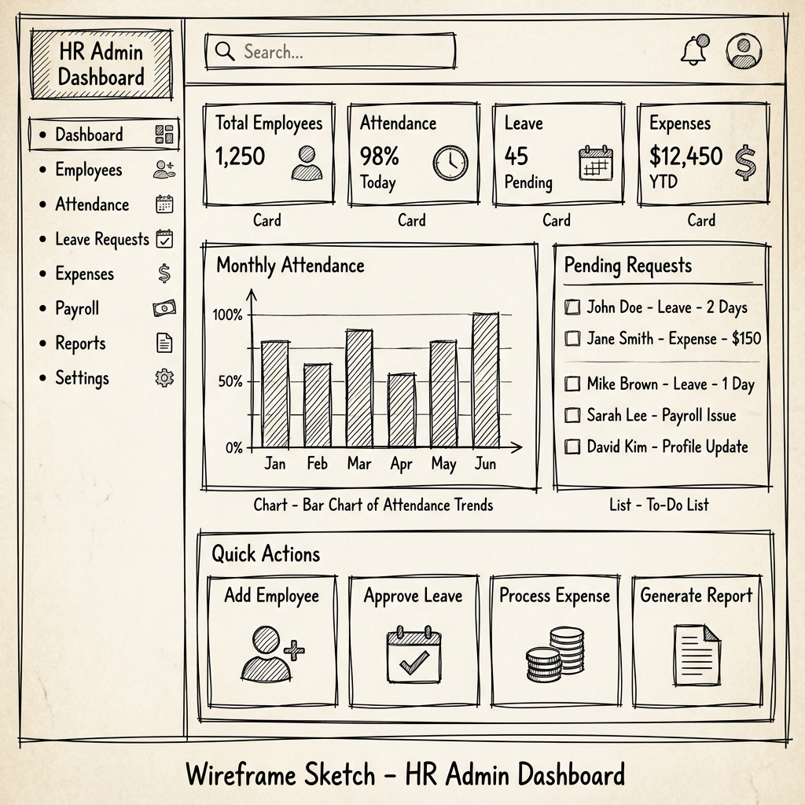

# Wireframe W02: HRM Admin Dashboard
**Requirement ID:** FRS002
**Role:** HR Administrator / System Admin

## 1. Visual Layout
**Style:** Dashboard Grid System (Responsive).
**Navigation:** Sidebar (Left) with "Dashboard" active.

## 2. Detailed Technical Specification
This layout strictly implements **FRS002** widgets and data.

### 2.1 Top Row (Key Metrics)
**Goal:** Immediate operational health check.

| Card Title | Data Source | Logic/Filter |
| :--- | :--- | :--- |
| **Total Employees** | Employee DB | Count of `Status = Active` |
| **New Hires** | Employee DB | Count of `Join Date = This Month` |
| **Permanent Staff** | Employee DB | Count of `Status = Permanent` |
| **Probation Staff** | Employee DB | Count of `Status = Probation` |

### 2.2 Middle Row (Activity Widgets)
**Goal:** Managing daily attendance and leave.

**Widget A: Attendance Summary (Pie Chart)**
*   **Visual:** Ring Chart with Legend.
*   **Segments:** `Present` (Green), `Absent` (Red), `Late` (Appears as slice or sub-text).
*   **Filter:** Defaults to `Today`.

**Widget B: Pending Action Items (List)**
*   **Title:** "Leave Requests Pending"
*   **Content:** Top 5 recent requests.
*   **Columns:** Avatar, Name, Leave Type (Sick/Casual), Status Badge.
*   **Action:** Click row -> Opens **Approval Details**.

### 2.3 Bottom Row (Communication & Calendar)
**Goal:** Awareness of notices, holidays, and events.

**Widget C: Notice Board Preview**
*   **Content:** List of valid Policy/Notice items.
*   **Display:** Icon, Title, Date.
*   **Action:** "View All" -> Go to FRS009.

**Widget D: Calendar Widget (FRS002 Required)**
*   **Type:** Read-only monthly calendar
*   **Content:** Holidays (Red), Events (Blue), Notices (Green)
*   **Interaction:** Hover shows event details
*   **Navigation:** Month/Year selector
*   **Legend:** Holiday types and event categories

### 2.4 Leave Summary Widget (Missing from FRS002)
**Goal:** Track leave applications status.

**Widget E: Leave Applications Summary**
*   **Metrics:** Total Applications, Pending Approvals, Approved This Month
*   **Chart:** Status breakdown (Pending/Approved/Rejected)
*   **Filter:** Current month by default
*   **Action:** "View All" -> Go to FRS005

**Global Filters (Header)**
*   [Date Range Picker]: Controls stats logic (Default: Current Month).
*   [Department Dropdown]: Filter dashboard by team (e.g., "IT Dept").

### 2.5 User-Specific Dashboard Variations
**Goal:** Role-based dashboard customization (FRS002 requirement).

**Super Admin Dashboard:**
*   All widgets + System health metrics + User activity logs

**HR Admin Dashboard:**
*   Employee stats + Attendance + Leave + Notice + Calendar

**HR Manager Dashboard:**
*   Team-specific stats + Direct reports + Approval queue

**Employee Dashboard:**
*   Personal attendance + Leave balance + Notices + Calendar + Quick actions

**Accounts Dashboard:**
*   Payroll metrics + Expense claims + Financial summaries

## 3. SRS Alignment Check
*   ✅ **Stats:** All 4 employee metric types from FRS002.1 included.
*   ✅ **Attendance Charts:** Attendance summary (FRS002.2) with pie chart.
*   ✅ **Leave Summary:** Leave applications summary widget added.
*   ✅ **Calendar:** Read-only calendar showing holidays, events, and notices (FRS002.4).
*   ✅ **User-Specific:** Role-based dashboard variations implemented (FRS002.5).
*   ✅ **Filters:** Day, Month, Date Range filtering capabilities included.
