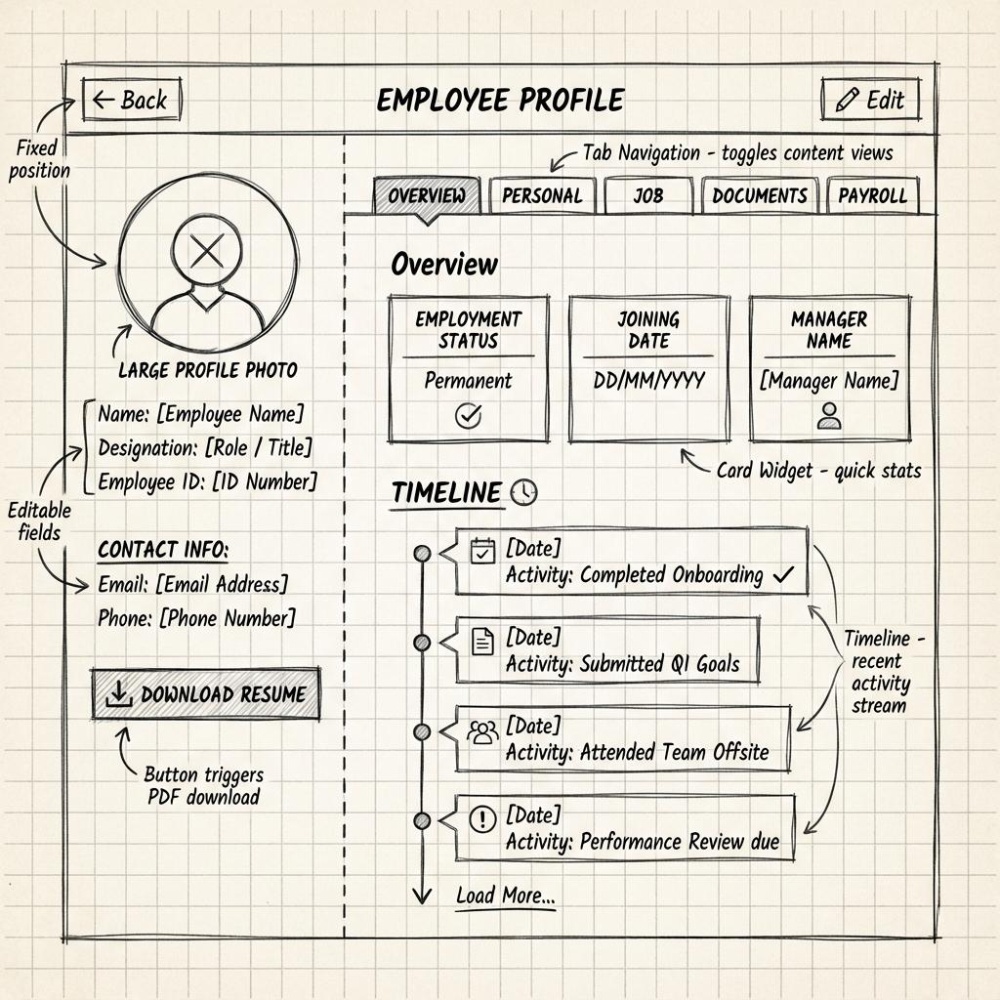

# Wireframe W03: Employee Management
**Requirement ID:** FRS003
**Role:** HR Manager / Admin

## 1. Screen 3.0: Employee List (Index Page)
**Goal:** Search and filter the workforce.

**Layout:**
*   **Top Bar:** "Add Employee" [Primary Button].
*   **Filter Bar:**
    *   [Institution Dropdown]
    *   [Branch Dropdown]
    *   [Department Dropdown]
    *   [Status] (Active/Inactive)
    *   [Search Input] (Name/ID)

**Data Grid Columns (FRS003):**
1.  **Employee Name** (with Avatar)
2.  **ID Number**
3.  **Department**
4.  **Branch**
5.  **Mobile Number**
6.  **Status** (Pill: Active/Probation/Terminated)
7.  **Actions:** [View Profile] [Edit]

## 2. Screen 3.1: Add Employee Wizard (Modal)
**Goal:** Structured data entry for complex profiles.

**Progress Header:** Step 1/6

### Step 1: Basic Info
*   **Full Name** (Text)
*   **Employee ID** (Text - Auto/Manual toggle)
*   **Mobile** (Tel)
*   **Email** (Email)

### Step 2: Organization Details
*   **Institution** (Dropdown: As-Sunnah / Madrasatus Sunnah)
*   **Branch** (Dropdown)
*   **Department** (Dropdown)
*   **Designation** (Text/Dropdown)

### Step 3: Employment Data
*   **Joining Date** (Date Picker)
*   **Status** (Dropdown: Probation / Permanent / Volunteer)
*   **Gross Salary** (Currency)
*   **Bank Info** (Account Name, No, Bank Name, Branch)

### Step 4: Personal Details
*   **Date of Birth** (Date Picker)
*   **Blood Group** (Dropdown)
*   **NID / Passport No** (Text)
*   **Marital Status** (Dropdown)

### Step 5: Address & Emergency
*   **Present Address** (Text Area)
*   **Permanent Address** (Checkbox: "Same as Present"?)
*   **Emergency Contact Name** (Text)
*   **Relation** (Dropdown)
*   **Contact No** (Tel)

### Step 6: Attachments
*   **Upload CV** (File Input)
*   **Upload Profile Image** (File Input)
*   **Upload Contract/NID** (File Input)

**Footer:** [Back] [Next / Submit]

## 3. Screen 3.2: Employee Profile View
**Layout:** Header + Tabs.

*   **Header:** Large Photo, Name, Designation, Branch.
*   **Metric:** "Total Days of Employment" (Auto-calculated).
*   **Tab 1: Overview:** Summary, Leave Balance, Recent Attendance.
*   **Tab 2: Personal:** Read-only view of Step 4 & 5.
*   **Tab 3: Job:** Read-only view of Step 2 & 3 + Promotion History.
*   **Tab 4: Documents:** Gallery of attachments.

## 4. SRS Alignment Check
*   ✅ **Fields:** All 40+ data fields from FRS003 mapped to wizard steps.
*   ✅ **Calculations:** "Total Days" included in Profile View.
*   ✅ **Filters:** Implementation of Instance/Branch filtering confirmed.
