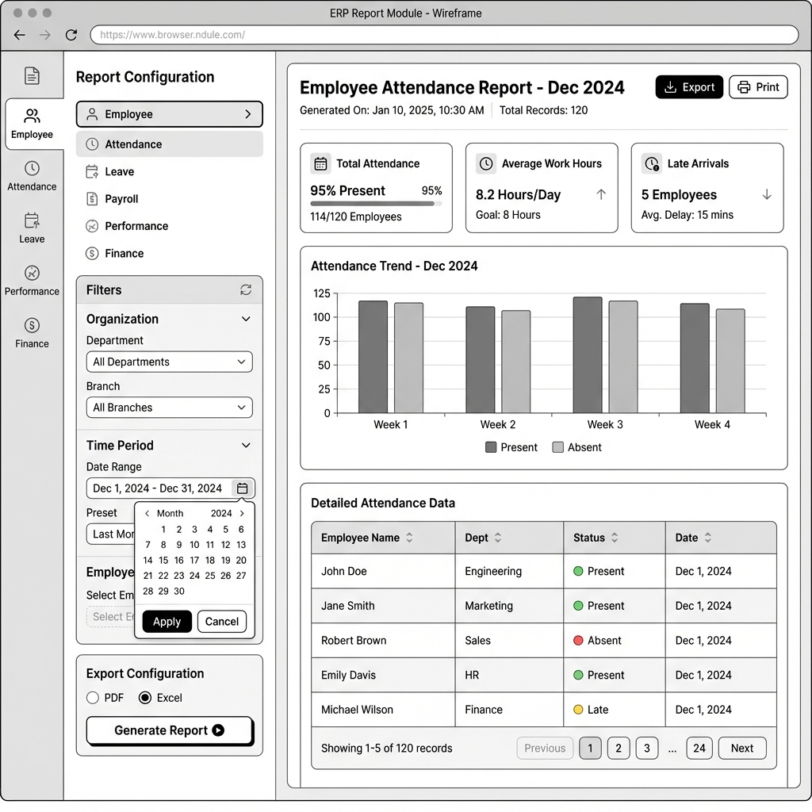

# Wireframe W11: Report Module

**Requirement ID:** FRS011
**Role:** Admin, HR Admin, Accounts Officer

## 1. Visual Layout

**Style:** Two-Panel Layout (Filter Sidebar + Report Preview)
**Navigation:** Sidebar with "Reports" active

## 2. Detailed Technical Specification

This wireframe implements **FRS011** consolidated reporting with dynamic filters and export capabilities.

### 2.1 Left Panel: Report Configuration (30% Width)

**Goal:** Configure report parameters and filters

#### Section A: Report Category Selection

**Component:** Vertical Tab List

| Category | Sub-Reports | Access Level |
|----------|-------------|--------------|
| **Employee** | Basic Info, Status, New Hires, Separation, Distribution | Admin/HR |
| **Attendance** | Daily Summary, History, Late Entry, Monthly Summary | Admin/HR |
| **Leave** | Application Summary, Balance, Type Usage, Response Time | Admin/HR |
| **Payroll** | Monthly Sheet, Tax Deduction, PF, Bank Templates | Admin/Accounts |
| **Expense** | Claim Report, Category-wise, Status Report | Admin/HR |
| **Notice** | Department/Branch Notice Report | Admin/HR |
| **User Management** | User List, Login History, Failed Attempts | Super Admin |

#### Section B: Dynamic Filters

**Component:** Collapsible Filter Groups

**Filter Group 1: Organization**

- **Department:** Multi-select dropdown (IT, HR, Finance, Operations)
- **Branch:** Multi-select dropdown (Head Office, Branch A, Branch B)
- **Institution:** Radio buttons (ASF, Madrasatus Sunnah)

**Filter Group 2: Time Period**

- **Date Range:** Date picker with presets (This Month, Last Month, Quarter, Year)
- **Custom Range:** Start Date + End Date inputs

**Filter Group 3: Employee Selection**

- **Specific Employees:** Multi-select with search
- **Employee Status:** Checkboxes (Active, Inactive, Probation, Permanent)
- **Designation:** Multi-select dropdown

**Filter Group 4: Report-Specific Filters**
*(Dynamically changes based on selected report category)*

- **Leave Reports:** Leave Type, Status (Pending/Approved/Rejected)
- **Attendance Reports:** Status (Present/Absent/Late)
- **Payroll Reports:** Payment Status, Salary Range
- **Expense Reports:** Category, Approval Status

#### Section C: Export Configuration

**Component:** Export Options Panel

**Format Selection:**

- Radio buttons: PDF, Excel (XLSX), CSV
- **PDF Options:** Page Size (A4/Letter), Orientation (Portrait/Landscape)
- **Excel Options:** Include Charts (Yes/No), Separate Sheets (Yes/No)

**Actions:**

- [Primary Button] **Generate Report**
- [Secondary Button] **Preview**
- [Link] **Save Configuration** (for frequent reports)

### 2.2 Right Panel: Report Preview/Results (70% Width)

**Goal:** Display generated report and provide download options

#### State 1: Initial/Empty State

**Content:**

- Icon: Document with chart
- **Heading:** "Select Report Category and Filters"
- **Subtext:** "Choose a report type from the left panel and configure your filters to generate a report"
- **Helper:** "Popular reports: Monthly Attendance, Employee List, Payroll Summary"

#### State 2: Loading State

**Content:**

- Loading spinner
- **Text:** "Generating your report..."
- Progress indicator (if applicable)

#### State 3: Report Preview

**Header Bar:**

- **Report Title:** Dynamic based on selection (e.g., "Employee Attendance Report - December 2024")
- **Generated:** Timestamp
- **Records:** Count (e.g., "147 employees")
- **Actions:** Download, Email, Print, Refresh

**Preview Content:**

- **Summary Cards:** Key metrics at top (Total Records, Date Range, Filters Applied)
- **Data Table:** Paginated results with sortable columns
- **Charts:** Relevant visualizations (attendance pie chart, leave trends, etc.)

#### State 4: Export Success

**Content:**

- Success icon
- **Message:** "Report generated successfully!"
- **Download Link:** "Click here to download your report"
- **Actions:** Generate Another Report, Email Report

### 2.3 Header Controls

**Global Actions:**

- **Breadcrumb:** Reports > [Category] > [Sub-Report]
- **Quick Filters:** Dropdown for "My Frequent Reports"
- **Help:** Tooltip/Guide for report generation

## 3. Interactive Behaviors

### 3.1 Filter Dependencies

- **Category Selection:** Updates available sub-reports and specific filters
- **Date Range:** Validates logical date ranges
- **Employee Selection:** Shows count of selected employees
- **Real-time Preview:** Updates record count as filters change

### 3.2 Report Generation Flow

1. User selects category → Sub-reports populate
2. User configures filters → Preview shows estimated record count
3. User clicks "Generate" → Loading state → Preview displays
4. User can export or modify filters for new report

### 3.3 Permission-Based Access

- **Super Admin:** Access to all report categories
- **HR Admin:** Employee, Attendance, Leave, Expense, Notice reports
- **Accounts:** Payroll, Employee (basic), Expense reports
- **Managers:** Limited to their team's data only

## 4. Technical Considerations

### 4.1 Performance

- **Lazy Loading:** Large reports load in chunks
- **Caching:** Frequently accessed reports cached for 15 minutes
- **Background Processing:** Large reports generated asynchronously

### 4.2 Export Formats

- **PDF:** Formatted with company header, page numbers, filters applied
- **Excel:** Multiple sheets for complex reports, charts included
- **CSV:** Raw data export for further analysis

### 4.3 Security

- **Role-based Access:** Filter options based on user permissions
- **Data Masking:** Sensitive data (salary details) masked for non-authorized users
- **Audit Trail:** Log all report generations with user and timestamp

## 5. SRS Alignment Check

- ✅ **Dynamic Filters:** Dept, Branch, Employee, Date Range implemented
- ✅ **Export Formats:** PDF, Excel (XLSX), CSV supported
- ✅ **Security:** Role-based access controls included
- ✅ **Categories:** All 7 report categories from FRS011 covered
- ✅ **Consolidated:** Single interface for all module reporting

## 6. Responsive Considerations

- **Mobile/Tablet:** Filter panel collapses to drawer
- **Small Screens:** Report preview switches to card-based layout
- **Touch:** Larger touch targets for filter selections
