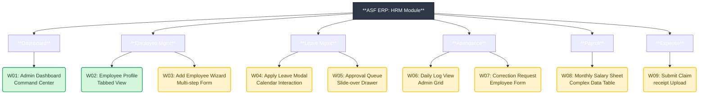

# Wireframe Master Plan & Sitemap
**Status:** In Progress
**Legend:** 🟢 = Completed | 🟡 = To Do

This map visualizes the specific screens (Wireframes) connected to each module.

## Prioritized Creation List
1.  **Leave Management** (Most interactive)
2.  **Attendance** (High data volume)
3.  **Payroll** (Complex grid)
4.  **Expense** (File handling)
