# Wireframe Master Plan & Sitemap
**Status:** ✅ COMPLETE - All 11 Wireframes Aligned with Client Requirements
**Last Updated:** December 2024
**Legend:** 🟢 = Completed & Requirements-Aligned

This comprehensive sitemap shows all wireframes with complete client requirement alignment.

```mermaid
graph TD
    %% Main Application Flow
    Root[**ASF ERP: HRM System**]:::root
    
    %% Authentication Flow
    Root --> Auth[**Authentication**]
    Auth --> W01(W01: Auth Flow<br/>Login/Signup/OTP/Email Verification<br/>Basic Setup Page):::done
    
    %% Core Modules
    Root --> Dash[**Dashboard Hub**]
    Root --> Emp[**Employee Management**]
    Root --> Pay[**Payroll System**]
    Root --> Leave[**Leave Management**]
    Root --> Att[**Attendance Tracking**]
    Root --> Exp[**Expense Management**]
    Root --> Policy[**Policy Management**]
    Root --> Notice[**Notice Board**]
    Root --> Users[**User Management**]
    Root --> Reports[**Reporting System**]

    %% Dashboard Wireframes
    Dash --> W02(W02: Role-Based Dashboard<br/>Stats + Calendar + Notifications<br/>User-Specific Views):::done
    
    %% Employee Management Wireframes
    Emp --> W03(W03: Employee Management<br/>List + Add Wizard + Profile View<br/>Complete CRUD Operations):::done
    
    %% Payroll Wireframes
    Pay --> W04(W04: Payroll Management<br/>Salary Sheet + Payslips + Certificates<br/>Auto-Email + Bank Integration):::done
    
    %% Leave Management Wireframes
    Leave --> W05(W05: Leave Management<br/>Dashboard + Application + Approval<br/>SMS/Email Notifications + HR Override):::done
    
    %% Attendance Wireframes
    Att --> W06(W06: Attendance Tracking<br/>Daily Logs + Manual Entry + Reports<br/>Biometric Sync + Export Features):::done
    
    %% Expense Management Wireframes
    Exp --> W07(W07: Expense Management<br/>Claims + Approval + Category Mgmt<br/>Limits + Export Reports):::done
    
    %% Policy Management Wireframes
    Policy --> W08(W08: Policy Management<br/>Holiday Calendar + Salary Rules<br/>Approval Workflows + Org Policies):::done
    
    %% Notice Board Wireframes
    Notice --> W09(W09: Notice Board<br/>Create + Approval + Feed<br/>Export + Analytics):::done
    
    %% User Management Wireframes
    Users --> W10(W10: User Management<br/>Directory + Custom Roles + Permissions<br/>Login History + Security Tracking):::done
    
    %% Reporting Wireframes
    Reports --> W11(W11: Report Module<br/>Generator + Filters + Export<br/>All Module Reports + Analytics):::done

    %% Styling
    classDef root fill:#1a365d,color:#fff,stroke:#2c5282,stroke-width:3px;
    classDef done fill:#22543d,stroke:#38a169,color:#f0fff4,stroke-width:2px;
```

## Complete Wireframe Inventory

### ✅ Authentication & Setup (1 Wireframe)
- **W01: Authentication Flow** - Login, Signup, OTP Verification, Email Verification, Basic Setup Page

### ✅ Core HRM Modules (10 Wireframes)
- **W02: Dashboard** - Role-based dashboards with calendar, stats, notifications
- **W03: Employee Management** - Complete employee lifecycle management
- **W04: Payroll Management** - Salary processing, payslips, certificates
- **W05: Leave Management** - Application, approval, notifications, HR override
- **W06: Attendance Tracking** - Biometric sync, manual entry, comprehensive reports
- **W07: Expense Management** - Claims, approvals, category limits, export
- **W08: Policy Management** - Calendar, salary rules, approval workflows
- **W09: Notice Board** - Creation, approval, targeting, export
- **W10: User Management** - Custom roles, permissions, login tracking
- **W11: Report Module** - Comprehensive reporting across all modules

## Requirements Alignment Summary

### 🎯 100% Client Requirements Coverage
- **All FRS001-FRS011** functional requirements mapped to wireframes
- **Complete user flows** from signup to daily operations
- **Role-based access control** implemented across all modules
- **Notification systems** (SMS/Email) integrated where required
- **Export capabilities** added to all relevant modules
- **Approval workflows** implemented for policies and notices
- **Manual overrides** and admin controls included
- **Integration points** clearly defined between modules

### 🔧 Key Enhancements Added
- **OTP and Email Verification** flows in authentication
- **Calendar integration** in dashboard and policy management
- **Salary certificate generation** in payroll
- **Manual attendance entry** capabilities
- **Category limits and controls** in expense management
- **Custom role creation** in user management
- **Login history and security tracking**
- **Comprehensive export options** across all modules

## Next Phase: Interactive Prototypes
With all wireframes complete and requirements-aligned, the next phase involves:
1. **Interactive Prototype Creation** - Clickable flows for user testing
2. **Design System Development** - Typography, colors, components
3. **High-Fidelity Mockups** - Pixel-perfect visual designs
